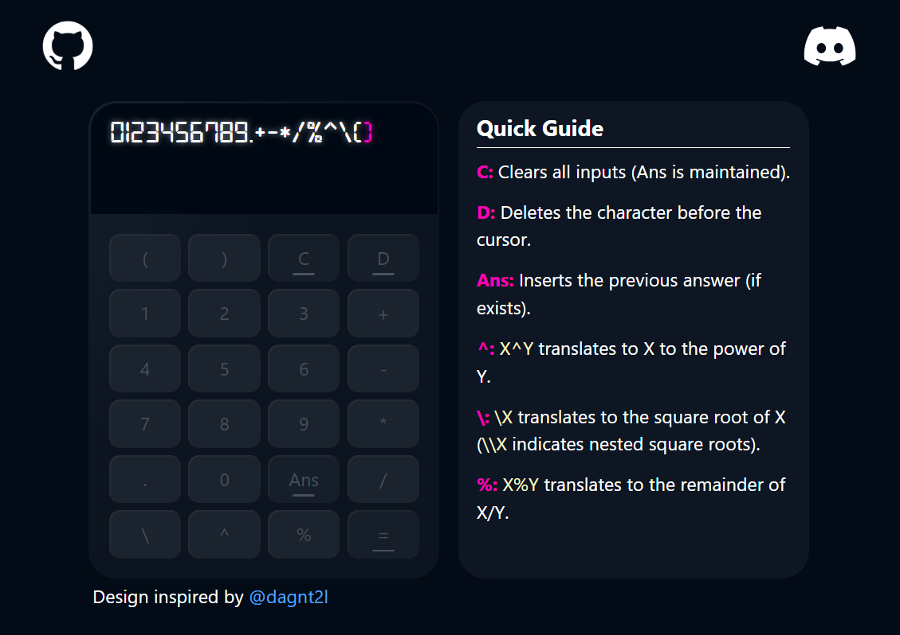
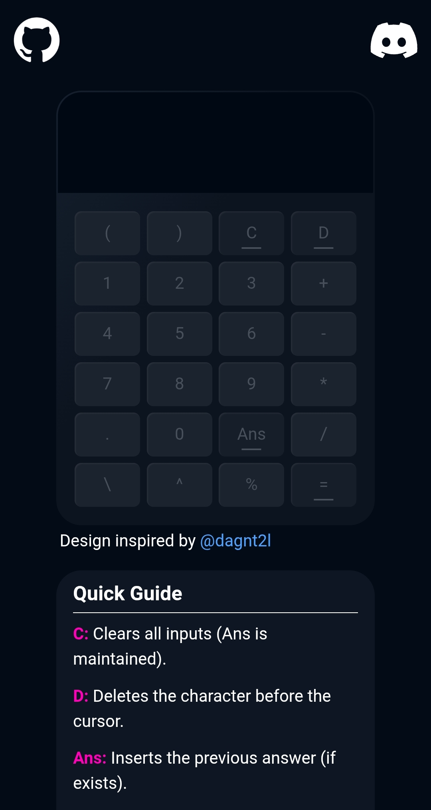

# Calculator App - Cocolater
Cocolater is a modern-looking calculator app, with an impressive design (shoutout to [@dagn2l](https://x.com/dagnt2l)), built to make you feel premium while doing your math.

## Features
- Addition
- Subtraction
- Multiplication (implicit and explicit)
- Division
- Modulo
- Exponents 
- Square Root (with support for nested expressions)
- Parentheses

## Live App
 [cocolater.vercel.app](https://cocolater.vercel.app/)

## Preview
### Desktop


### Mobile


## Technologies:
  1. **React + Typescript**
  2. **Tailwind CSS**
  3. **Framer Motion**
  4. **Vercel**


## Build Instructions
  * Requirements:
    - Node.js v18 or higher.
    - npm
  1. Clone the repository:  
  ``` git clone https://github.com/WDataW/fancy-calculator.git ``` 
  2. Move into the project directory:  
  ``` cd fancy-calculator ```
  3. Install dependencies:  
  ``` npm install ```
  4. Run the development server:  
  ``` npm run dev ```
  5. Build for production:  
  ``` npm run build ```
  6. Preview production build:  
  ``` npm run preview ```

##  Deploy Instructions
  1. Clone or fork this repository in your github account.
  2. Go to https://vercel.com/ 
  3. Link your github account to Vercel
  4. Import the cloned/forked github repo into Vercel.
  5. Keep the default build configurations and click deploy.
